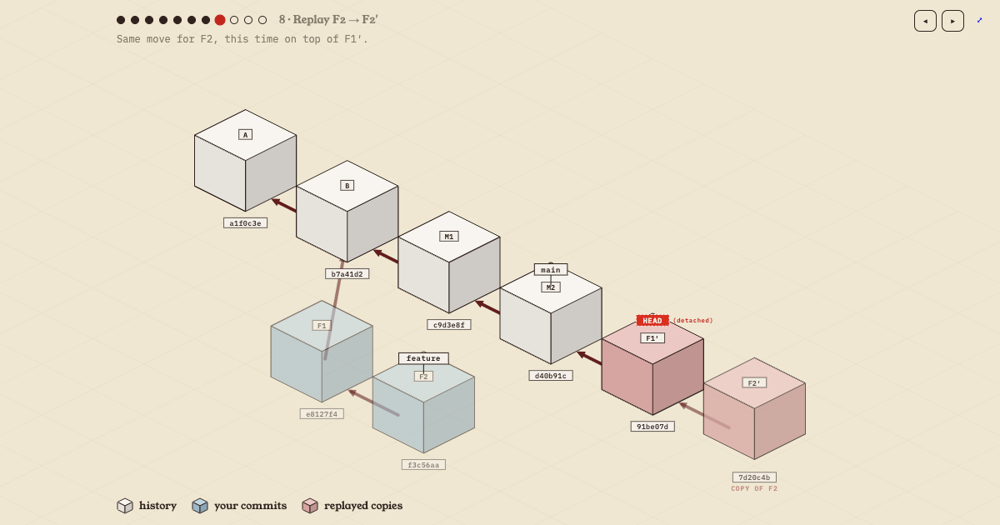

# gitblocks

**git, block by block** — animated, isometric walkthroughs of what git commands
*actually* do, plus a live sandbox where you type the commands yourself.

**Live: [git.redstone.university](https://git.redstone.university)** · a
[Redstone University](https://redstone.university) companion.



Like RxMarbles was for Rx: no prose walls, no man pages, just the mental model,
animated. One rule does most of the teaching — **commits are blocks that never
move**. Refs are tags that do. A change in flight is a redstone torch. Because
the geometry forbids motion, the animations can't lie: rebase has to look like
copying, reset has to look like a pointer abandoning blocks, and merge has to
look like one new block with two parent wires.

## The animations

| group | pages |
| :-- | :-- |
| start here | [basics](https://git.redstone.university/basics) · [the sandbox](https://git.redstone.university/playground) |
| rewriting | [rebase](https://git.redstone.university/rebase) · [interactive-rebase](https://git.redstone.university/interactive-rebase) · [rebase-onto](https://git.redstone.university/rebase-onto) · [amend](https://git.redstone.university/amend) · [cherry-pick](https://git.redstone.university/cherry-pick) |
| combining | [merge](https://git.redstone.university/merge) · [fast-forward](https://git.redstone.university/fast-forward) · [squash-merge](https://git.redstone.university/squash-merge) |
| undoing | [reset](https://git.redstone.university/reset) · [revert](https://git.redstone.university/revert) |
| syncing | [fetch-pull](https://git.redstone.university/fetch-pull) |
| exploring | [detached-head](https://git.redstone.university/detached-head) |

Every page plays itself on a loop until you take the controls, and every step's
commands type themselves into the terminal below the figure.

## The sandbox

[git.redstone.university/playground](https://git.redstone.university/playground)
is an open-ended repo with a real terminal. Every command animates the blocks:

- `commit` (and `--amend`), `branch`/`-d`/`-D`, `switch`/`-c`/`--detach`, `checkout`
- `merge` (`--no-ff`, `--squash`), `rebase` (`-i` auto-squashes, `--onto`)
- `cherry-pick`, `revert`, `reset` (`--soft`/`--mixed`/`--hard`)
- `log`, `status`, refs like `HEAD~2`, `main^`, sha prefixes
- aliases: `g`, `c`, `co`, `sw`, `br`, `l`, `s`, `cp`
- `undo`, `help`, and `share` — which copies a link that **replays your whole
  session, typed out character by character, on a loop**, until whoever opened
  it types a command and takes over

It's a teaching model, not real git: there are no files, so merges never
conflict, and there's no network (the [fetch-pull](https://git.redstone.university/fetch-pull)
animation covers that story).

## Sharing & embedding

URLs are the product:

- `?step=N` deep-links a step; the address bar tracks where you are
- `?embed` strips the chrome for iframes; `&loop` makes it play itself

```html
<iframe src="https://git.redstone.university/rebase?embed&step=7"
        width="100%" height="460"></iframe>
```

- sandbox `share` links (`/playground?s=…`) encode the command history and
  replay deterministically — same shas, same layout, every time

## How it's built

No frameworks, no libraries, no build step. Two classic `<script>` tags per
page; the only external requests are two Google Fonts. It runs from `file://`.

- `gitblocks.js` / `gitblocks.css` — the shared engine: a hand-rolled 2:1
  isometric SVG renderer (`P(gx,gy,z) = [(gx−gy)·36, (gx+gy)·18 − z]`),
  step tweens on `requestAnimationFrame`, ref tags, the terminal, embed mode
- `vizzes/<name>.js` — one data file per animation: commits, steps, copy
- `playground.js` — the sandbox: an in-browser git model (plain objects),
  deterministic so `?s=` replays are exact
- `<name>.html` — thin pages: fonts + engine + data

The visual language is borrowed from the
[redstone-university](https://github.com/fielding/redstone-university) render
pipeline — paper/ink, pastel block families, schematic redstone-dust wires.
The terminal wears the [Human++](https://github.com/fielding/human-plus-plus)
palette on warm charcoal.

## Development

Open any page directly, or:

```
npx serve
```

Pushing `main` deploys production; branches get preview URLs.
